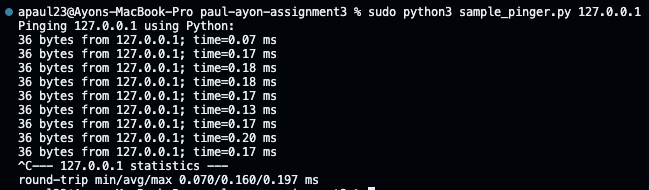
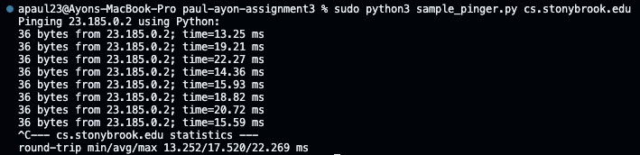
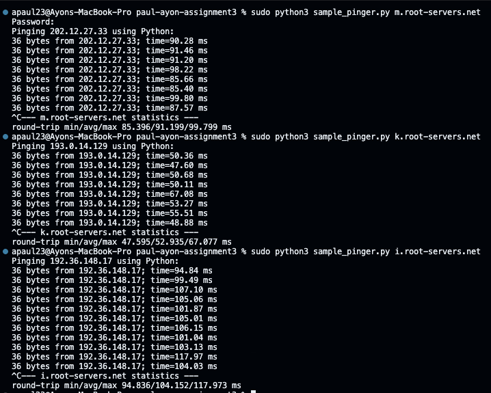

# sample_pinger.py

When recording the minimum RTT for each part, I noticed that the minimum increased when going from pinging localhost to pinging cs.stonybrook.edu, and then finally pinging the 3 root servers outside the US. This is to be expected because of my router's distance to each part only increases, meaning the min RTT will naturally increase too to match this increase in proximity.

 

1. When pinging localhost, I found that the minimum RTT was 0.07 ms and the average was 0.16 ms. This is to be expected because of my proximity to the localhost. That is, the localhost is running on my computer, pinging the localhost is moreso of a simulation of a packet rather than a actual exchange itself.

 

2. When pinging cs.stonybrook.edu, the minimum naturally increased from my localhost due to me living farther away from this host's router. The minimum RTT I found was 13.252 ms, with the average RTT being 17.52 ms. While this is drastically higher than localhost, this number accurately reflects me pinging cs.stonybrook.edu in the city rather than on campus.

 

3. I ended up choosing to ping the root servers maintained by Netnod, RIPE NCC, and Wide Project respectfully. These root servers reside in Sweden (Netnod), the Middle East (RIPE NCC), and Tokyo (WIDE Project). After pinging each of these servers, I found that RIPE NCC's root server had the smallest minimum RTT of 47.595 ms out of all 3, followed by WIDE Project's root server with a mimnimum RTT of 85.396 ms, and Netnod with a minimum of 94.836. While it would make more sense for Netnod's minimum RTT to be the smallest of the 3 because it's located the closest to the US, it being the longest to ping may be a result of various factors such as network traffic and more hops needed to get to the root server than the other two. Besides Netnod though, WIDE Project's root server taking longer to ping than RIPE NCC makes sense because WIDE Project's root server is located farther away from the US than RIPE NCC's. It may also be possible that there are less routers between mine and RIPE NCC's server than there are between mine and WIDE's project's server. This would help explain why WIDE Project's minimum RTT is almost double that of RIPE NCC's.

